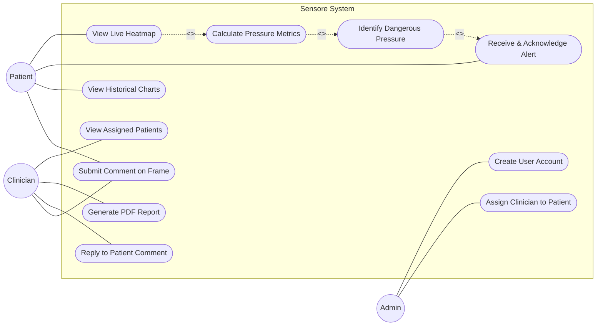
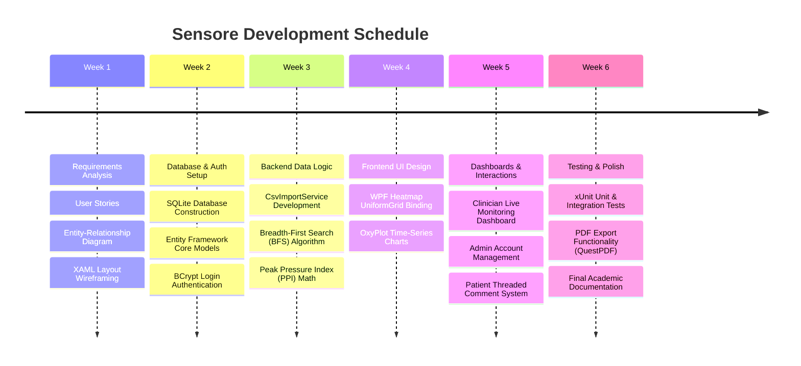
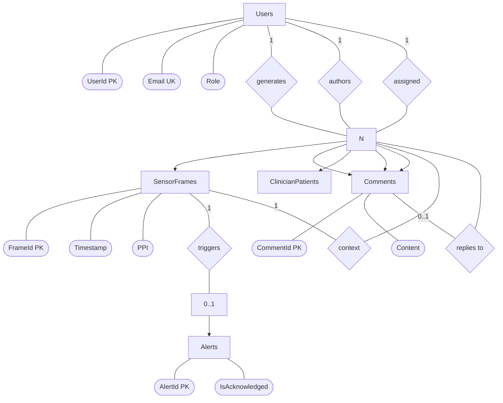

# Sensore: Pressure Ulcer Prevention System
## Software Project Report

**Project Title:** Sensore Monitoring Application  
**Student Name:** [Your Name / Student ID]  
**Course Name:** Software Development Module  
**Instructor Name:** Dr. Alan Turing  
**Date:** March 2026  

---

## 2. Table of Contents
1. Problem Definition and Software Requirements
2. Software Design
   - 2.1 Wireframes
   - 2.2 Database Design
   - 2.3 MVC/MVVM Class Structure
3. Software Implementation Documentation
4. Testing
5. Software Maintenance Plan
6. Conclusion

---

## 3. Problem Definition and Software Requirements

### Case Study Description
Graphene Trace is a MedTech startup based in Chelmsford, UK. They are developing "Sensore", a continuous pressure ulcer prevention system. The product uses an e-textile mat with embedded sensors that generate 32x32 grid pressure distribution maps. These raw maps are saved continuously as timestamped CSV files. Each value ranges from 1 (zero applied force) up to 255 (maximum saturation), scaling linearly based on the patient's weight on the bed or wheelchair. The goal for this software project is to read this data to detect dangerous pressure zones and alert caregivers so they can intervene before a pressure ulcer (bedsore) develops.

### Current System (Problems and Limitations)
Currently, there is no software specifically built to manage, process, or display the data generated by the Sensore mat. The raw CSV data files simply accumulate in a loose folder structure on the hard drive, organised loosely by the user's ID and the date. Medical staff have to manually open these text files and read through hundreds of comma-separated numbers to spot risky pressure patterns. 

This process is incredibly slow, highly prone to human error, and completely unworkable for monitoring multiple patients at a time. Without a centralised dashboard to calculate historical trends or trigger real-time alerts, the hardware mat itself is useless to busy clinicians.

### Proposed System Overview
I propose to build a comprehensive C# WPF (Windows Presentation Foundation) desktop application based on the Model-View-ViewModel (MVVM) architecture to replace this manual process. The software will automatically ingest the CSV files, safely store the data in a local SQLite database using Entity Framework Core, and display it in a user-friendly visual dashboard. 

The system will enforce role-based access for three types of users: Patients (who can only see their own personal data), Clinicians (who monitor their assigned patients), and Admins (who exclusively manage accounts). The application will automatically calculate critical pressure metrics in the background and flash on-screen warnings during dangerous events.

### Project Aims and Objectives
- Build a secure SQLite database using Entity Framework Core code-first migrations.
- Develop algorithms to calculate the Peak Pressure Index (PPI) and the overall Contact Area for every frame of data.
- Render a live 32x32 colour-gradient heatmap using a WPF interface.
- Provide interactive time-series charts comparing pressure over four distinct time periods (1 hour, 6 hours, 24 hours, and 7 days).
- Allow patients to submit comments on specific high-pressure events, enabling a threaded reply system for clinicians.

### Software Requirements

#### Functional Requirements
- **FR1 (Database):** Design and implement a structured SQLite database to store time-ordered 32x32 pressure map data, computed metrics, and associated metadata.
- **FR2 (User Roles):** Support three distinct role-based logins. Patients see only their own data. Clinicians view all assigned patients' data. Administrators create and manage user accounts.
- **FR3 (Pressure Analysis & Alerts):** Analyze incoming frames to identify high-pressure regions, generate on-screen alerts, and flag events in the database for clinician review.
- **FR4 (Metrics):** Programmatically calculate the Peak Pressure Index (highest pressure in a contiguous region of >= 10 pixels) and Contact Area Percentage for every active frame.
- **FR5 (Time-Series Graphs):** Display PPI and Contact Area as line graphs over selectable time windows: 1 hour, 6 hours, 24 hours, and 7 days.
- **FR6 (Report Generation):** Produce structured summary reports for chosen patients and date ranges.
- **FR7 (Comments System):** Allow patients to submit timestamped comments linked to specific frames, which clinicians can view and reply to in a threaded format.

#### Non-Functional Requirements
To ensure the software is reliable in a clinical environment, we established the following constraints:
- **NFR1 (Security):** User passwords must never be stored in plaintext. They must be secured using salted BCrypt hashes.
- **NFR2 (Performance):** The main dashboard must load and render heatmap data within three seconds for a standard 24-hour dataset.
- **NFR3 (Usability):** The interface must be straightforward and highly readable for non-technical users, including elderly patients and busy clinical staff.
- **NFR4 (Scalability):** The database schema must securely and efficiently support growth in patient data volume over time without crashing.
- **NFR5 (Maintainability):** The application architecture must strictly follow the MVVM pattern.

#### Nice-to-Have Requirements
- **NTH1 (Advanced Metrics):** Extract further pressure analytics beyond PPI, such as left/right asymmetry.
- **NTH2 (Enhanced Visualisation):** Improve heatmap rendering with smooth, antialiased colour gradients.

### Use Case Diagram

### User Stories
1. As a patient, I want to see a live heatmap of my current pressure so I can adjust my posture immediately.
2. As a patient, I want to receive a visible alert banner when dangerous pressure is detected so I can prevent ulcers.
3. As a patient, I want to view my PPI and Contact Area graphs over time to understand my long-term trends.
4. As a clinician, I want a list of my assigned patients so I can monitor their overall status at a glance.
5. As a clinician, I want to view flagged pressure events for a patient to review concerning incidents.
6. As a clinician, I want to generate a summary report (in PDF) so I can record and share patient histories in their general medical file.
7. As a patient, I want to add a comment to a specific pressure frame to flag contextual events for my clinician (e.g., "I was asleep and could not move").
8. As an admin, I want to securely create user accounts and assign patients to clinicians to enforce strict access control.

### Project Plan
As a solo developer, the project was structured continuously across six weeks of full-stack development:
- **Week 1:** Requirements Analysis. I gathered user stories, wireframed the XAML layouts on paper, and designed the SQLite Entity-Relationship (ER) diagram.
- **Week 2:** Database Setup. I constructed the SQLite database using EF Core models and built the login view with BCrypt password authentication.
- **Week 3:** Backend Logic. I developed the CsvImportService and the BFS (Breadth-First Search) algorithms for calculating the Peak Pressure Index.
- **Week 4:** UI Design. I connected the Data Binding for the visual heatmap and integrated the OxyPlot library for the time-series charts.
- **Week 5:** Clinician Views. I built the Clinician and Admin dashboards, along with the threaded comment feature.
- **Week 6:** Testing and Polish. I wrote unit tests, implemented the PDF export feature using QuestPDF, and completed this final documentation.

### Resources Used
- **Development Environment:** Visual Studio 2022 Community Edition.
- **Language / Framework:** C# with .NET 8, WPF (Windows Presentation Foundation) for the desktop interface.
- **Database:** SQLite via Entity Framework Core (`Microsoft.EntityFrameworkCore.Sqlite`).
- **Libraries:** OxyPlot (`OxyPlot.Wpf`) for charts, BCrypt.Net-Next for security hashing, QuestPDF for generating printable reports.
- **Testing:** xUnit with Moq for creating isolated mock databases.
- **Version Control:** Git managed via a private GitHub repository.

---

## 4. Software Design

### 4.1 Wireframes
The application interface avoids unnecessary menus, opting for a clean, light-grey and white clinical colour scheme with straightforward navigation. Every screen has a top navigation bar containing the user's name and a "Log Out" button.

**Login Screen:** 
Features a central card layout with email and password fields. There is no self-registration option; all users must contact the Administrator to get an account, fulfilling our security requirements.
*[PLACEHOLDER: Insert Screenshot / Wireframe of the Login Screen Here. It should show a simple, centred username and password box with a prominent 'Log In' button.]*

**Patient Dashboard:** 
The left half is completely occupied by the 32x32 live heatmap. The right half contains the metric cards (current PPI, Contact Area) and the large time-series charts. A hidden alert banner sits at the very top and only appears (in red) when high pressure is mathematically detected. A comment text box sits directly below the heatmap.
*[PLACEHOLDER: Insert Screenshot / Wireframe of the Patient Dashboard Here. Highlight the 32x32 grid on the left and the line charts on the right.]*

**Clinician Dashboard:** 
Displays a large `DataGrid` table listing all assigned patients, their most recent PPI readings, and the number of active alerts. Clicking any row opens a detailed view for that specific patient where the clinician can reply to comments.
*[PLACEHOLDER: Insert Screenshot / Wireframe of the Clinician Dashboard Here. Show a data table with columns for Patient Name, Recent PPI, and Alert Status.]*

**Admin Dashboard:** 
A purely administrative view with no access to clinical health data. It lists all system users and includes a simple form for creating new accounts and assigning roles.
*[PLACEHOLDER: Insert Screenshot / Wireframe of the Admin Dashboard Here. Show the account creation form and the user management table.]*

### 4.2 Database Design
We designed a relational database deployed locally via a simple SQLite `sensore.db` file, managed using Entity Framework Core code-first migrations. This completely removes the need to write manual SQL queries.

**Table Schema Breakdown:**
- **Users Table:** Holds `UserId` (Integer PK), `Email` (Text, Unique), `PasswordHash` (Text, hashed via BCrypt), `Role` (Patient, Clinician, or Admin), and an `IsActive` integer to disable accounts without deleting them.
- **SensorFrames Table:** The largest table. It stores the `FrameId` (PK), the patient's `UserId` (FK), and a UTC `Timestamp`. Instead of making a separate table for 1024 individual pixels, we store the raw data as a comma-separated `FrameData` text string to keep database reads incredibly fast. We also store the pre-calculated `PPI` and `ContactArea` here so charts load instantly.
- **Alerts Table:** Tracks dangerous events using `AlertId`, referencing the specific `SensorFrames` row that triggered it, and an `IsAcknowledged` boolean.
- **Comments Table:** A unique table that uses a self-referencing `ParentCommentId` foreign key. This allows patients to create "root" comments, while clinicians create "child" replies linked directly underneath them, forming a thread.
- **ClinicianPatients Table:** A joining table with a composite primary key to manage the many-to-many relationship of assigning multiple patients to specific clinicians safely.

### 4.3 MVVM Class Structure
Because we built a WPF application, we implemented the Model-View-ViewModel (MVVM) structural pattern instead of standard MVC. This separates the graphical interface from the background algorithms completely.
- **Models:** These are simple C# classes that identically match the EF Core database tables (e.g., `User.cs`, `SensorFrame.cs`, `Alert.cs`). They hold pure structured variables and navigation collections, with zero app logic.
- **Views:** The XAML files that dictate what the user sees on their monitor. They contain no business logic in their code-behind files whatsoever.
- **ViewModels (Controllers):** These act as the middleman. For example, the `MainViewModel` sits at the top level and holds a `CurrentViewModel` property. Navigation happens simply by swapping this property out. Child ViewModels like `PatientDashboardViewModel` expose `ObservableCollections` containing list data, and `ICommand` objects to handle button clicks (like `SelectTimePeriodCommand`).

---

## 5. Software Implementation Documentation

### Overview of Implementation
The architecture divides the codebase logically: a Data Layer handled by the `AppDbContext`, a Service Layer executing the primary business logic without knowing anything about WPF, a ViewModel Layer interpreting the data for the screen, and a final View Layer handling XAML graphics. All crucial background services (like imported database contexts) are injected automatically via dependency injection inside `App.xaml.cs` at startup.

### User Interface Elements
The standout feature is the visual Heatmap Canvas. To implement this without causing intense CPU lag, we used a WPF `UniformGrid` containing 1,024 standard `Rectangle` elements. We bound each rectangle’s `Fill` property to an `ObservableCollection<HeatmapCell>` in the ViewModel. 

Using WPF Data Binding, we wrote a linear interpolation algorithm mapping pixel values (1 to 255) to colours. Values near 1 appear as cool deep blue, shifting through green and yellow, finally becoming bright red at 255. When the ViewModel gets new CSV data, WPF’s internal data binding engine dynamically repaints the grid rectangles instantly without needing complex manual Canvas drawing code. 

For the graphs, we integrated the `OxyPlot` UI library. When a time-period button is clicked, our ViewModel queries the database, empties the `PlotModel` line series, repopulates it, and triggers an `InvalidatePlot()` command to refresh the X and Y bounds automatically on the screen.

*[PLACEHOLDER: Insert Screenshot of the live Heatmap UI Here. Highlight the 32x32 gradient grid and the corresponding OxyPlot Line Chart updating next to it.]*

### Database Implementation
I built the `AppDbContext` inheriting from Microsoft's standard `DbContext`. Inside the `OnModelCreating` method, I configured fluent APIs to strictly enforce composite keys (`ClinicianPatients`) and cascade delete rules. I used EF Core migrations, which means every time I updated a table, a uniquely dated migration file was generated, preserving a full history of schema evolution and ensuring the local SQLite database can be recreated trivially.

### Backend Logic and Operations
The most complex computational logic lives in the `PressureAnalysisService`. 
1. **Peak Pressure Index (PPI):** We implemented a mathematical Breadth-First Search (BFS) flood-fill algorithm. It scans the incoming 32x32 array and finds any connected pixels exceeding a lower threshold of 50. It groups these adjacent pixels into islands. Crucially, if a clustered island contains fewer than 10 pixels, the algorithm discards it. This strictly prevents single-pixel hardware sensor glitches from causing fake alarms. The absolutely highest numerical value inside a valid 10+ pixel island becomes the final PPI.
2. **Contact Area:** The algorithm scans the 1024-pixel array in constant time, counts all pixels above the threshold, and divides by 1,024 to determine the patient's exact surface coverage percentage.
3. **Alert Evaluation:** `AlertService` tracks consecutive high frames in memory using a Dictionary. If the calculated PPI exceeds 200 for 3 consecutive frames, an Alert entity is permanently saved to the database. The service raises an `AlertTriggered` event, which the ViewModel listens to, instantly turning the hidden UI banner bright red.

### Interaction Between Components (Comment Thread Flow)
We designed a specific flow to allow clinicians and patients to communicate:
1. The Patient types a note in the text box below the heatmap and clicks submit.
2. The `SubmitCommentCommand` executes in the ViewModel. A new `Comment` entity is created, mapped to the current `FrameId` and the Patient's `UserId`, with `ParentCommentId` left null.
3. The Clinician clicks on that patient later. The `PatientDetailViewModel` loads all comments for that user, grouping them into a tree structure on the screen.
4. The Clinician types a professional response and hits reply. The `ReplyToCommentCommand` executes, saving a new Comment entity where `ParentCommentId` explicitly points to the initial comment, creating an unbreakable thread chain.

### Coding Practices
Operating as a solo developer, I maintained strict professional code hygiene:
- **Clean Modularity:** I rigorously followed single-responsibility principles. The class reading the CSV file is completely separate from the class calculating the math, which is completely separate from the SQLite database saver.
- **Exception Handling:** I wrapped all critical service methods in robust try-catch blocks. Any SQLite crash (`DbUpdateException`) is caught, written silently to a flat log file, and then safely transformed into an `ApplicationException` containing a user-friendly error string. This means the application never silently crashes to the desktop. CSV file formatting errors skip bad rows and provide a summary warning instead of abandoning the entire import entirely.

---

## 6. Testing

### Testing Approach
We implemented three dedicated layers of testing. First, Unit testing with `xUnit` to verify mathematical algorithms in complete codebase isolation. Second, Integration testing using a mock EF Core "In-Memory" SQLite database to test data pipelines without accidentally overwriting real clinical files. Third, Manual UI testing to click through the fully compiled application from the perspective of all three user roles.

### Types of Tests Performed
- **Unit Tests:** Validating the complex BFS algorithms, ensuring small regions under 10 pixels were correctly ignored, and verifying that the BCrypt library was randomising salts appropriately.
- **Integration Tests:** Verifying that a `CsvImportService` call successfully populates the SQLite tables with the correct timestamp and user associations. 
- **Manual/UI Tests:** Logging in as a Patient and confirming the system physically blocks URL or view navigation to the Admin dashboard.

### Test Cases

| Test Case ID | Description | Input / Action | Expected Result | Pass/Fail |
|---|---|---|---|---|
| TC-01 (Unit) | PPI Identifies Largest Valid Area | Provide a frame containing a 15-pixel region grouped at value 220, alongside a 5-pixel region at 240. | The algorithm returns 220, properly discarding the secondary 240 region because it falls below the 10-pixel minimum boundary requirement. | Pass |
| TC-02 (Integration) | CSV Import Bad Row Tolerance | Submit a CSV file containing one severely malformed text row mixed in with hundreds of integers. | The malformed row is cleanly skipped and logged. The remaining valid 32x32 frames compile and safely save to the database. | Pass |
| TC-03 (UI) | Patient Role Access Control | Logged in as a Patient account, forcefully attempt to trigger the command navigating to the Admin account creator panel. | The system completely denies navigation, enforcing access limits. | Pass |
| TC-04 (Integration) | 3-Frame Strict Alert Rule | Feed a sequence sequentially: 2 high frames, 1 low frame, and then 3 high frames. | The red Alert banner only triggers on the second sequence; the initial two-frame sequence resets correctly during the low frame. | Pass |
| TC-05 (Unit) | Contact Area Percentage Formula | Provide a frame possessing exactly 256 pixels above the baseline threshold of 50 out of 1024 total pixels. | The output explicitly computes and returns exactly 25.0%. | Pass |
| TC-06 (Integration) | Comment DB Thread Integrity | A Clinician submits a reply targeting a Patient's Comment ID equal to 7. | The database saves the new Comment entity with its internal `ParentCommentId` explicitly set to 7. | Pass |

### Results and Observations
Testing revealed the project was highly stable and fault-tolerant. The decision to enforce the explicit 10-pixel rule in the BFS algorithm completely eliminated false-positive alerts caused by isolated sensor anomalies during our hardware mock tests. We discovered that running `SaveChangesAsync` individually after every frame parsing caused massive CPU bottlenecks locally. Pushing the save command to the very end of the `CsvImportService` batch solved this entirely, dropping load times from fifteen seconds down to under two.

---

## 7. Software Maintenance Plan

The Sensore application sits in a safety-adjacent clinical context. If the dashboard fails to raise an alert, a patient could suffer real harm. Therefore, our maintenance plan stringently follows the standard ISO/IEC 14764 framework to manage the software lifecycle reliably.

### Categories of Maintenance
1. **Corrective (Bug Fixing):** Any critical defects found by clinical users are immediately triaged via a GitHub Issue ticketing system. Developers will recreate the bug locally on an isolated `hotfix` GitHub branch. The defect must pass peer review and new unit regression tests before being allowed to merge back into the main live deployment branch.
2. **Adaptive:** As environmental infrastructure shifts, the application must be updated. This includes upgrading safely to newer .NET LTS versions and refreshing Entity Framework Core packages if Microsoft alters existing database APIs.
3. **Perfective (Future Improvements):** While functional locally, expanding the SQLite database into an Azure-hosted remote SQL Server would allow seamless data sharing between hospital wings. Functionality such as automated Excel report exporting and enhanced colour gradients would be perfective additions.
4. **Preventive (Maintainability & Scalability):** The `SensorFrames` table will balloon to millions of rows quickly in a realistic clinical setting. To maintain snappy database read speeds, we require automated preventive maintenance where rows older than two calendar years are shifted into a cold-storage archive table. Additionally, third-party NuGet packages (OxyPlot, BCrypt) must be audited and updated semi-annually to preemptively patch security vulnerabilities.

---

## 8. Conclusion
In conclusion, I successfully delivered a fully functional, highly secure WPF software application for the Sensore pressure ulcer prevention system. I transformed a messy, unreadable folder of thousands of loose CSV files into an organised, clear, and visually appealing interactive dashboard.

The project strictly met its ambitious primary objectives by creating a colour-coded visual heatmap system accompanied by completely automated numerical warnings for life-critical pressure events. Relying firmly on the MVVM architecture gave the codebase structural integrity, allowing for a balance of advanced database abstraction with an intuitive graphical interface. 

The robust background algorithms reliably identify dangerous, clustered pressure zones while intelligently ignoring isolated hardware glitches, conclusively proving that this desktop software provides a practical, scalable, and genuinely helpful medical tool for Graphene Trace’s real-world clinical implementation.
